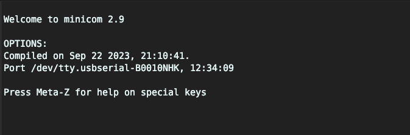
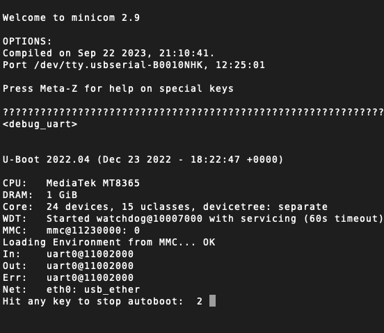
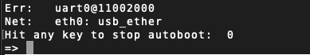
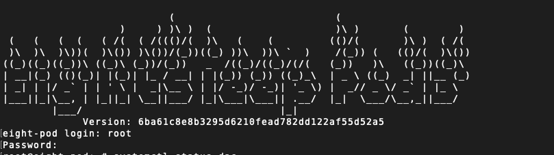
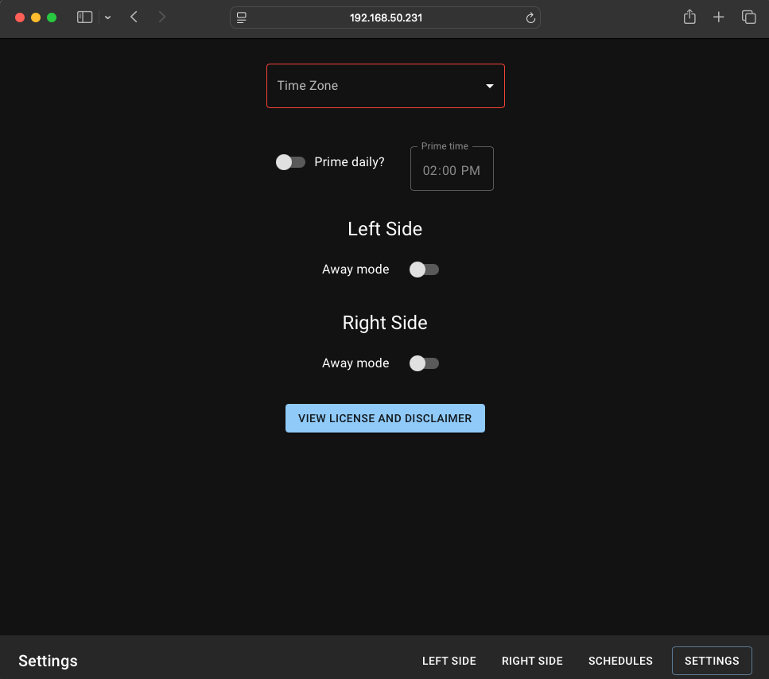

# REQUIREMENTS
## Compatability
- Pod 3 - FCC ID: 2AYXT61100001 (The FCC ID is located in the back of the pod where you plug in the water tubes)

- Pod 4


## What to do if you want to undo everything and go back to the eight sleep app
1. If you already had your pod added to your 8 sleep account in your app, go to your 8 sleep app and manage your pod, remove the pod from your account
2. [Reset the firmware again as you did here](docs/pod_teardown/10_firmware_reset.jpeg)
3. Set up the pod as a new pod in the app

## Setup
Follow the images in [docs/pod_teardown](docs/pod_teardown) to take apart your pod & setup the JTAG connection. For pod 4, the way to take apart the pod is a little different. Will have instructions for that later


---

### 1. Connect to device
- Your pod should be unplugged at this point. It doesn't not need a connection to the cover or power at this point.
- Connect your FTDI FT232RL to your computer 
- Your FTDI FT232RL should be connected to the tag connect cable. See the following images:
  - [8_tx_and_rx.jpeg](docs/pod_teardown/8_tx_and_rx.jpeg)
  - [9_module_connection.png](docs/pod_teardown/9_module_connection.png) 
  - [docs/pod_teardown/11_pod_3_board_connection.jpeg](docs/pod_teardown/11_pod_3_board_connection.jpeg)


---

### 2. Get the minicom session ready on your computer
- The baud rate is 921600
- If for some reason you're using a different device, you'll need to figure that out yourself
```
minicom -b 921600 -o -D /dev/tty.usbserial-B0010NHK
```
- You should see this screen (at least on mac), if you don't run `ls /dev/tty*`, your device might be under something else




---

### 3. Plug the power into the pod  

Get ready to interrupt the boot when you see `Hit any key to stop autoboot`. (I just hit CTRL + C)



If you did it correctly, you'll see this 



---


### 4.Modify the boot environment, this allows us to get root access

```
# VERIFY your current_slot = a, if not, go back and firmware reset your pod
# If it's still not = a, create an issue in github 
printenv current_slot

# If you have current_slot=a
setenv bootargs "root=PARTLABEL=rootfs_a rootwait init=/bin/bash"

run bootcmd
```

---


### 5. Mount the file system

```
# Mount /proc for process and system information
mount -t proc proc /proc

# Mount /sys for hardware and system-level information
mount -t sysfs sysfs /sys

# Mount /dev for device files (e.g., /dev/mmcblk0)
mount -t devtmpfs devtmpfs /dev

# Mount /run (optional but useful for some runtime scripts)
mount -t tmpfs tmpfs /run

# Mount the file system in read write mode (BE CAREFUL EDITING MODIFYING FILES)
mount -o remount,rw /
```

---


### 6. Update password for root & rewt

```
passwd root
passwd rewt
```
---


### 7. Sync the file changes

```
sync
```

---


### 8. Reboot (DO NOT INTERRUPT BOOT THIS TIME)

```
reboot -f
```

---

### 9. Login as root with the password we set
On the pod 4, this screen will be slightly different, that's OK



---


### 10. Disable software updates

You may see some failures saying these services were not loaded or do not exist, that's ok
```
# Disables the software updates
systemctl disable --now swupdate-progress swupdate defibrillator eight-kernel telegraf vector frankenfirmware dac swupdate.socket

# Blocks the software updates if we ever restart or power off the device
systemctl mask swupdate-progress swupdate defibrillator eight-kernel telegraf vector frankenfirmware dac swupdate.socket
```

---

### 11. Setup internet access

```
# Replace WIFI_NAME and PASSWORD with your actual WiFi credentials
# (WIFI_NAME appears twice)
# 
# DO NOT USE A GUEST NETWORK OR TRY TO DO ANYTHING FANCY TO PREVENT IT FROM TALKING TO THE INTERNET
#   If you want to block internet access to the pod, we can do that with firewall rules later

nmcli connection add type wifi con-name WIFI_NAME ifname wlan0 ssid WIFI_NAME wifi-sec.key-mgmt wpa-psk wifi-sec.psk "PASSWORD" ipv4.method auto ipv6.method auto

# Reload the network manager
nmcli connection reload
```

---


### 12. THIS STEP IS FOR POD 4 USERS ONLY! POD 3 USERS SKIP THIS STEP
Your firmware uses a different dac.sock path location, all you need to do is run this command. This tell the free-sleep app where to establish a dac.sock connection
```
echo '/home/dac/app/sewer/dac.sock' > /home/dac/dac_sock_path.txt
```

---


### 13. Install the free-sleep app, this will setup a systemctl service that auto runs on boot
```
/bin/bash -c "$(curl -fsSL https://raw.githubusercontent.com/throwaway31265/free-sleep/main/scripts/install.sh)"
```

---


### 14. Get your pods IP address

```
# Yours will be different, that's okay
nmcli -g ip4.address device show wlan0
192.168.1.50/24
```

---


### 15. With a device connected to the SAME Wi-Fi network you setup in step 11, navigate to your pod's IP address (port 3000)

SET YOUR TIME ZONE, OR ELSE SCHEDULING WILL NOT WORK! This can be done on the settings page of the web app. See screenshot below

http://192.168.1.50:3000/



---


### 16. Validation

#### Verify the site is still up
1. Unplug the power from your device and plug it back in 
2. Wait up to 4 minutes or so, ensure you can still access the site from another device
3. If the site is still up, you should be good

#### Verify the controls work
1. I would recommend setting up steps 16 and 17 below (block WAN traffic & setup SSH access for debugging & upgrading free-sleep)
2. Disconnect the tag-connect cable and power from your pod
3. Connect your pod to the cover as you normally would 4
4. Using the free-sleep site, set a temperature. (I would suggest the highest temp on one side and the lowest temp on the other side)
5. Physically verify the temps change (lay on the cover, use a thermometer, whatever)
6. If the temps change, you're all set! 
7. If it's not working
   1. Create an issue in github with the output from your minicom session
   2. Login as root to your device with your minicom session again and paste the output of these commands
```
systemctl list-units --type=service --no-pager
journalctl -u free-sleep --no-pager --output=cat
ps aux
find /home/dac/free-sleep/server -path /home/dac/free-sleep/server/node_modules -prune -o -type f -print
which npm
node -v
which node
node -v
iptables -L
```


You can view logs with `journalctl -u free-sleep --no-pager --output=cat` 
I will eventually add a shell script to execute to upgrade free-sleep. Feel free to create pull requests to add new features or fix bugs. Thanks! 


---

## These last steps are optional

### 16. Add firewall rules to block access to the internet (optional, but recommended)
```
sh /home/dac/free-sleep/scripts/block_internet_access.sh

# You can undo this with 
sh /home/dac/free-sleep/scripts/unblock_internet_access.sh
```

---


### 17. Add an ssh config
This will ask for a public key, ssh access is on port 8822 (ex: `ssh root@<POD_IP> -p 8822') 
```
sh /home/dac/free-sleep/scripts/setup_ssh.sh
```

