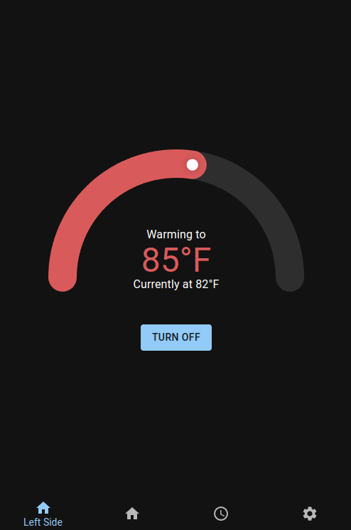
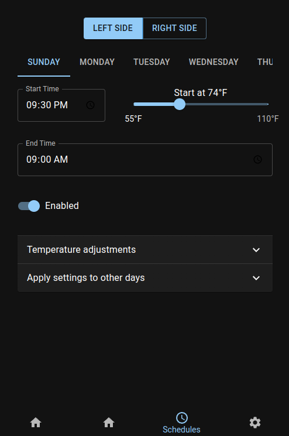
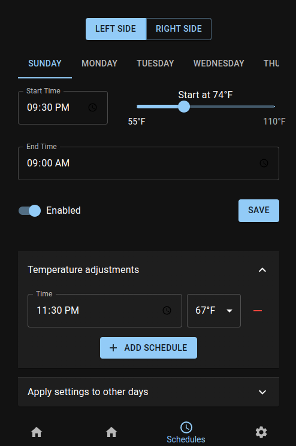

# Free Sleep: 8 Sleep Manager

## Features
- Allows complete control of device WITHOUT requiring internet access. If you lose internet, your pod WILL NOT turn off, it will continue working! You can completely block WAN internet access if you'd like too. (I blocked all internet access from my pod on my router...)
- WARNING: This will bypass blocked devices, please use responsibly.
- Dynamic temperature control with real-time updates.
- Schedule management: Set power on/off times and temperature adjustments.
- Settings customization: Configure timezones, away mode, and priming schedules.
- Responsive design for desktop and mobile.

--- 

## Overview
Free Sleep is an open-source project designed to control and manage temperature schedules and settings for a device locally. It includes:
- **Server**: A backend that interacts with the device through custom APIs.
- **App**: A frontend React application for user-friendly interaction with the device.

This project is intended to be entirely ran on an 8 sleep pod

---

### **Server**
- REST API for managing device settings, schedules, and status.
- Modular design with routes for `deviceStatus`, `settings`, `schedules`, and `execute`.
- Uses Node.js and Express for lightweight, fast operations.

---

## Tech Stack
- **Server**: Node.js, Express, TypeScript.
- **App**: React, Material-UI, Zustand, React Query.
- **Database**: LowDB for simple JSON-based storage.

---

## App screenshots

## Future planned work
- Adding support for alarms and scheduling
- Making the UI "prettier"
- Identifying sources for advanced metrics (HRV, heart rate, snoring)

## Contributing

- I'm happy to approve pull requests as long as it makes sense, clearly documented, and in TypeScript

---

## Support

If you find this project helpful and would like to support its continued development, you can send a tip to my Bitcoin address.   

BTC Address:
bc1qfpjx9nw7zzrt48gk2g5x0k2trcxxy0agmvnux6

Thank you for your support!
