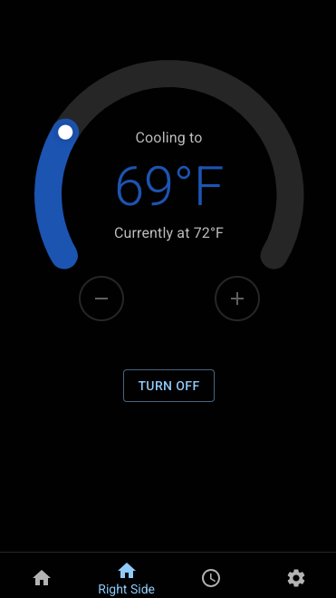
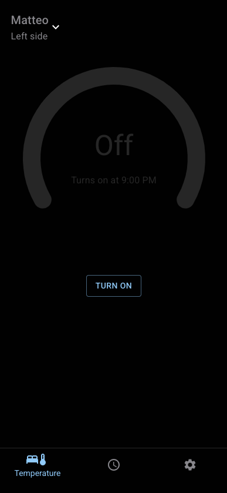
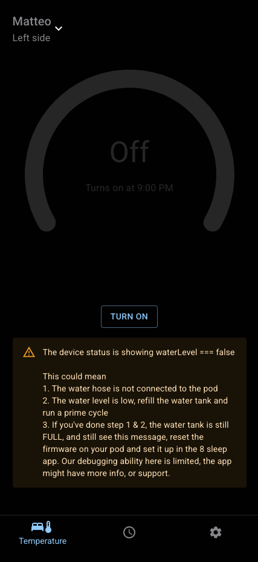
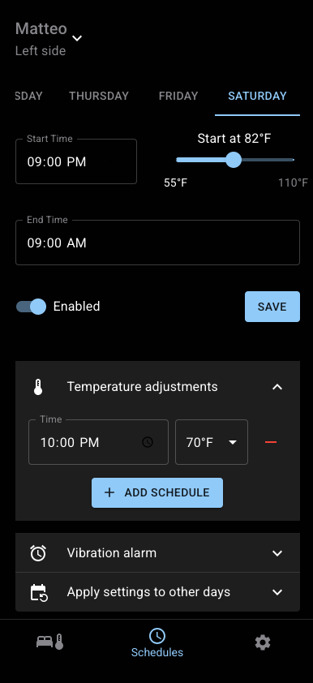
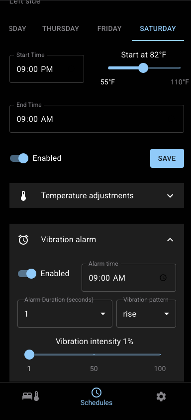
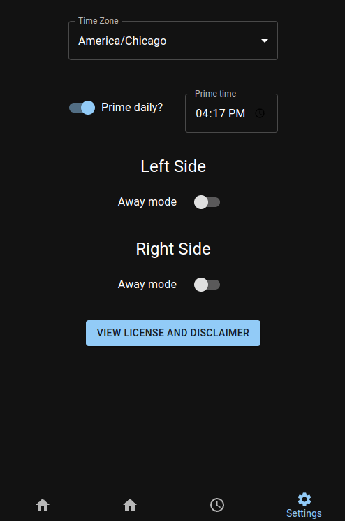

# Free Sleep: 8 Sleep Manager

## Follow us on Discord!
https://discord.gg/JpArXnBgEj
- Feature requests
- Updates
- Support

## [HOW TO INSTALL](./INSTALLATION.md)

---  

## Is it reversible?
Yes, I tested reversing it on my pod 3 by  [resetting the firmware](docs/pod_3_teardown/6_firmware_reset.jpeg). After the reset, setup your pod as a new pod again.

## Tested and confirmed compatible devices
Check the back of your pod where you plug in the water tubes, 
- Pod 3 - FCC ID: 2AYXT61100001
  - *It should work on other pod 3 models with the OS on a microSD card, the steps would actually be easier since you wouldn't need the tools required below. If someone wants to give it a shot, follow the steps here to get ssh & root access https://blopker.com/writing/04-zerosleep-1/
- Pod 4

## Features
- Allows complete control of device WITHOUT requiring internet access. If you lose internet, your pod WILL NOT turn off, it will continue working! You can completely block WAN internet access if you'd like too. (I blocked all internet access from my pod on my router...)
- WARNING: This will bypass blocked devices, please use responsibly
- Dynamic temperature control with real-time updates
- Schedule management: 
  - Set power on/off times 
  - Schedule temperature adjustments
  - Schedule daily time to prime the pod
  - Alarms
- Settings customization: Configure timezones, away mode, brightness of LED on pod
- Website works on desktop and mobile

## Limitations
- Requires your device to be on the same Wi-Fi as the pod
- No authentication is implemented
- Does not have sleep statistics available (HRV, hear rate, REM time, snore time, etc.), this is a WIP

--- 

## Overview
Free Sleep is an open-source project designed to control and manage temperature schedules and settings for a device locally. It includes:
- **Server**: A backend that interacts with the device through custom APIs.
- **App**: A frontend React application for user-friendly interaction with the device.

This project is intended to be entirely ran on an 8 sleep pod

---

### **Server**
- REST API for managing device settings, schedules, and status.
- Modular design with routes for `deviceStatus`, `settings`, `schedules`, and `execute`.
- Uses Node.js and Express for lightweight, fast operations.

---

## Tech Stack
- **Server**: Node.js, Express, TypeScript.
- **App**: React, Material-UI, Zustand, React Query.
- **Database**: LowDB for simple JSON-based storage.

---

## App screenshots

## Future planned work
- Making the UI "prettier"
- Identifying sources for advanced metrics (HRV, heart rate, snoring)

## Contributing

- I'm happy to approve pull requests as long as it makes sense, clearly documented, and in TypeScript

---

## Support

If you find this project helpful and would like to support its continued development, you can send a tip to my Bitcoin address.   

BTC Address:
bc1qjapkufh65gs68v2mkvrzq2ney3vnvv87jdxxg6

Thank you for your support!
